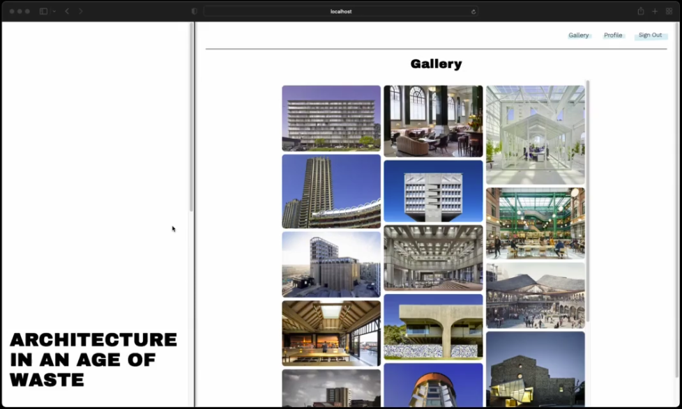
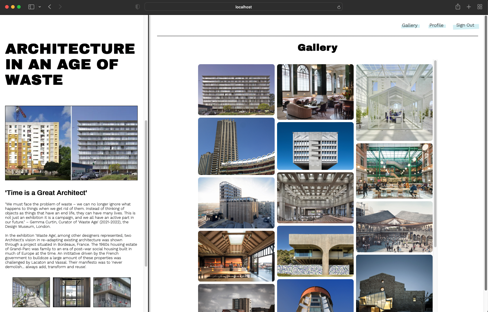
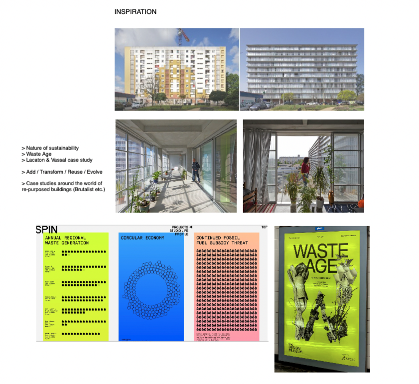
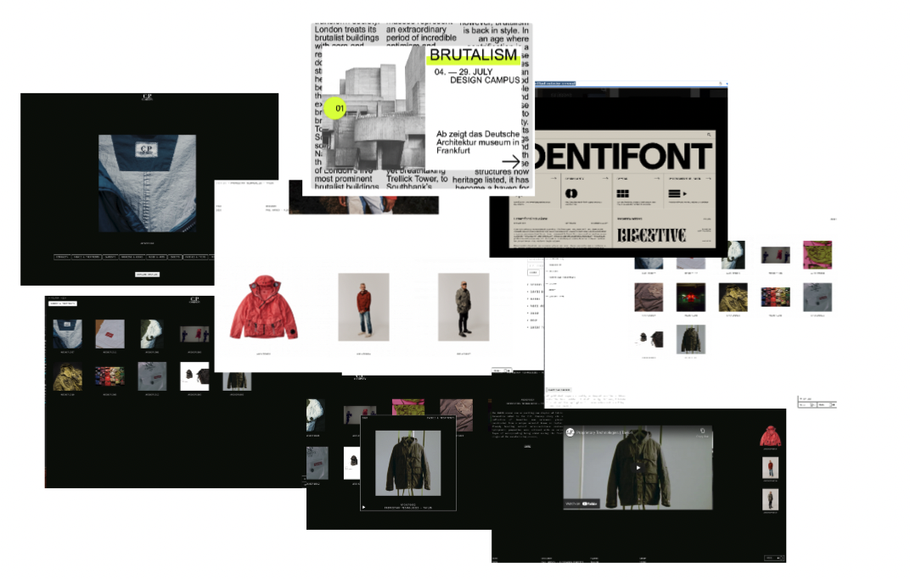
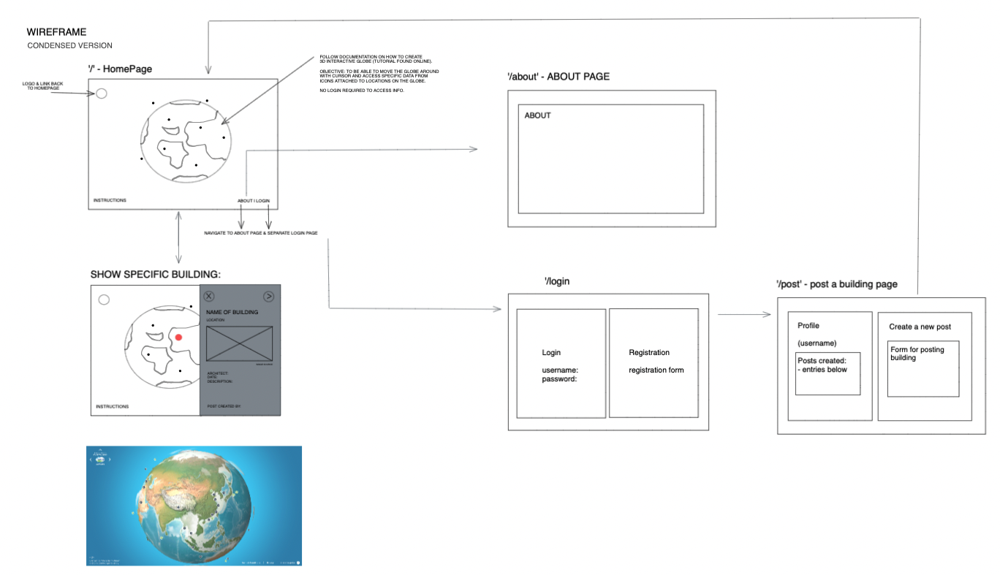
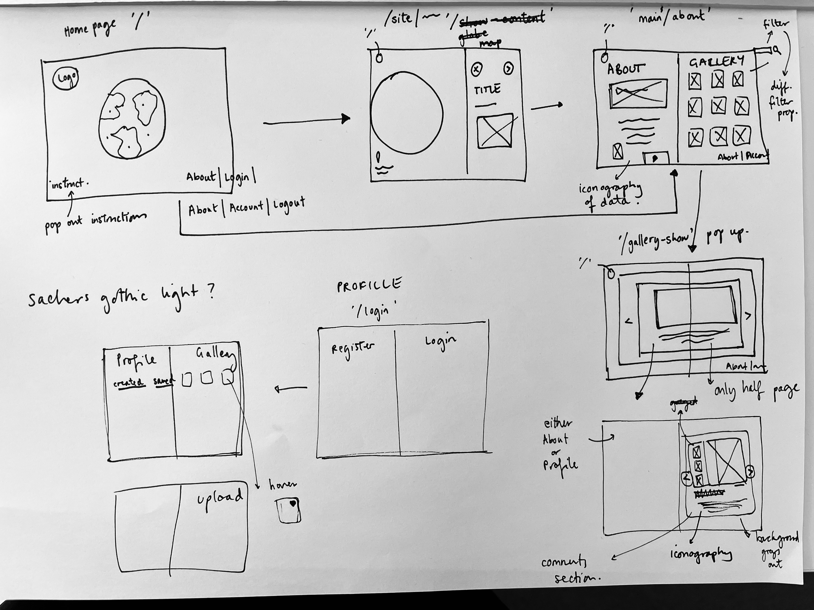

# GA Project 3: ‘Architecture in an Age of Waste’

## Overview

For our final and fourth project during the General Assembly’s Software Engineering Immersive course, we built an app using a React, Python and Django framework. We were given one week to complete a full stack app. 

Inspired by an exhibition this year shown at the Design Museum, London, titled ‘Waste Age’, I chose to focus on the theme ‘Architecture in an Age of Waste’. Here, I wanted to showcase on an interactive 3D globe about interesting architectural projects that focus on adaptation rather than demolition. The 3D globe was inspired by a [tutorial](https://www.esri.com/arcgis-blog/products/js-api-arcgis/3d-gis/interactive-3d-globe/) and example using the Esri ARCgis API and Vanilla JavaScript/HTML. 
 
The user would be able to navigate around the world and learn more about these projects interactively. In the project pop-up, there would be a comments section where users could interact and discuss the projects uploaded. 

Unfortunately, I was unable to fulfil this feature and end-product within the timeframe, and had to recalibrate my project’s design and features mid-way through the week. 

🖥 Jump to the [Demo](#demo) section to see the app in action!


## Navigation

* [The App](#the-app)
* [The Brief](#the-brief)
* [Technologies Used](#technologies-used)
* [General Approach](#general-approach)
  * [Planning](#planning)
  * [Wireframing](#wireframing)
* [Build Approach](#build-approach)
  * [Frontend Interface](#frontend-interface)
  * [Backend](#backend)
* [Demo](#demo)
* [Challenges](#challenges)
* [Wins](#wins)
* [Key Learnings](#key-learnings)
* [Future Improvements](#future-improvements)
* [Credits](#credits)

## The App





[Demo](#demo)

## The Brief
* Build a full-stack application using a Python Django API and Django REST Framework to serve the data from a Postgres database. 
* Consume the API with a separate front-end built with React. 
* Have working relationships between models. 
* Time: One Week.

## Technologies Used
 * JavaScript (ES6+)
 * HTML5/CSS3/SASS
 * React.js
 * Python
 * Django
 * Material UI
 * Axios
 * Visual Studio Code & Pylint
 * Git & GitHub
 * Insomnia
 * TablePlus
 
## General Approach

### Planning
As with all my previous projects on this course, there was a heavy emphasis on creating a moodboard alongside my wireframe and initial planning process. I started out what was seemingly a straightforward concept which required very little planning. The idea (shown below in the wireframe) consisted of a main page and a login/profile page for the user to input data into. 





During the week as I began to tackle the task of creating this 3D globe and understanding its feasibility, the task became increasingly difficult to achieve as time went on. I had to make a constructive decision to go back to the drawing board half-way through the week and start again. Here I re-created a moodboard and drew upon a sketch drawn up at the beginning of the project for stretch goals if the 3D globe could be achieved in time (see below). 

### Wireframing


Sketch of re-worked wireframe mid-week: 




## Build Approach

### Frontend Interface

* End product (changed mid-way through the week): 
* Set up API, Axios and Get Request Method. 
* Understanding Routing (BrowserRouter, Routes, Route). 
* Using components. 
* Using Material UI templates for forms. 
* User registration forms, user login/logout format. 
* Utilise useNavigate. 

Similar to Project 2 and Project 3, we use axios, useState and useEffect functions to access and utilise our API.  

__Styling:__

I wanted to explore the idea of split screens on one page where you could scroll on both sides but remain in the same location. I think I achieved this but there are probably better ways of doing this and perhaps the content is not best suited to this feature. However, I’m happy with learning how to achieve a feature like this for future projects. 


### Backend

* Adding secure mode to API user and secret/password protection via…..
* Creating database models and views and setting up initial data in the django app. 
* Accessing this data via request (route) parameters.
* Creating controllers. 
* Initialising User Authentication. 
* Updating database documents with Authentication. 
* Assigning ObjectId to data with reference relationships. 


__Authentication:__

The authenticate method overrides the default authentication that is executed when we access any secure route. We use this to customise the authentication. Here I used imported permissions ‘IsAuthenticatedOrReadOnly’ when submitting a new building entry and retrieving all buildings displayed on the database. 

```javascript
from rest_framework.permissions import IsAuthenticatedOrReadOnly

# Create your views here.
class BuildingListView(APIView):
   permissions_classes = (IsAuthenticatedOrReadOnly, )

   # POST - Add a new building to the database
   def post(self, request):
       deserialized_building = BuildingSerializer(data=request.data)
       try:
           deserialized_building.is_valid(True)
           deserialized_building.save()
           return Response(deserialized_building.data, status.HTTP_201_CREATED)
       except ValidationError:
         print(deserialized_building.errors)
         return Response(deserialized_building.errors, status.HTTP_422_UNPROCESSABLE_ENTITY)         
       except Exception as e:
           print(type(e))
           print(e)
           return Response({ 'detail': str(e) }, status.HTTP_422_UNPROCESSABLE_ENTITY)
  ```         
 
 Here, to get the request body we use the data key on the request object. We then pass python into a serializer to convert the data into a QuerySet (deserialization). The serializer gives us the methods to check the validity of the data being passed through the form into the database. It checks our model, and ensures it passes our instructed validation. If it fails the validation, it throws us an error. If not, the data has been saved and a data key is assigned to the Building instance that contains a python copy of the data that has just been created. 

## Demo

https://user-images.githubusercontent.com/103049670/183925359-9e233ac2-69c0-4a15-a4d8-9e25b02f13b0.mp4


## Challenges
* With only a week spent learning Python and Django, I felt there was still a lot to grasp and understand before going into a solo project. Albeit daunting, I still managed to achieve an app that connects the front and back-end together as desired. 
* With this push back, I was limited with testing features and expanding it with more functions. 


## Wins
* Despite changing direction half way through the week, and finding myself with no front-end or back-end at this point, I’m happy that I was able to achieve the current outcome in just a few days. 


## Key Learnings
* A lot of time was spent on the front-end on this project and not enough time researching whether it was achievable in the timeframe. Although there were numerous tutorials and ample documentation on using the Esri ARCgis API and developer tools, there was not a huge amount of useful resources online focusing on React and how we had learnt it through the course (functional components vs class components). 
* In all four projects, a key learning has been an awareness that refactored code makes efficient code - this I believe is something I will develop with practice and repetition and a deeper understanding of the programs used. 


## Future Improvements
* I intend to develop this app as originally designed with the 3D interactive globe. With discussions on stackOverflow and gitHub I hope to interact with fellow programmers in trying to achieve this. 


